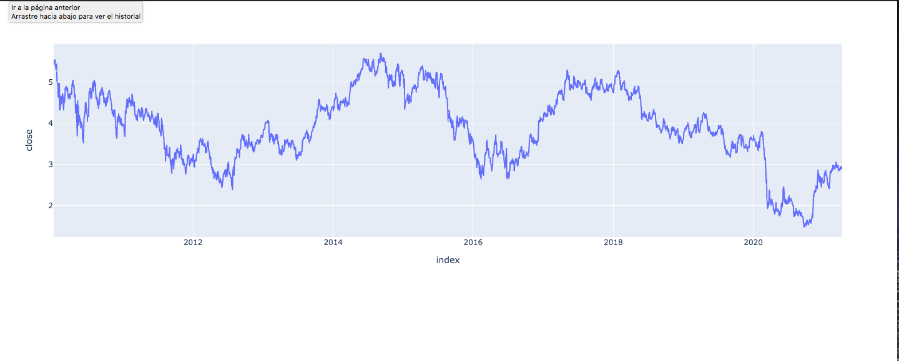

# Aplicación Dash Final

---

- Vamos a realizar una aplicación que nos muestre los datos del API IEX.
- De forma iterativa mejoraremos la aplicación.

---
# Ejercicio
- Mostramos los datos de cierre en una gráfica de línea de un activo cualquiera.

- Añadimos títulos y Subtítulos.

---

- Generamos un dropdown con algunos tickers disintos. Al cambiar el ticker se tiene tiene que actualizar el gráfico.

---
- Cambiamos el gráfico de linea por un gráfico de velas.
- Generamos un dropdown que nos permita cambiar la gráfica entre velas y lineas.
